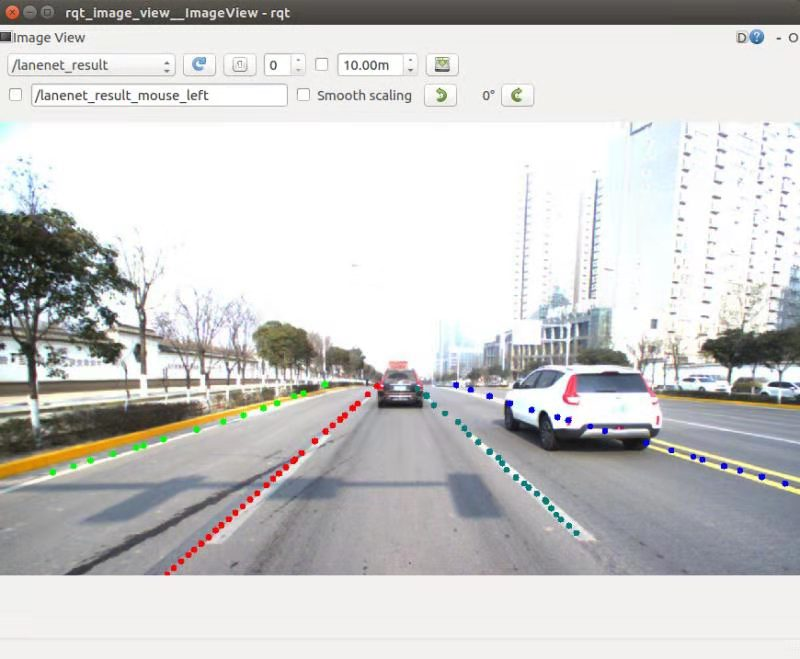
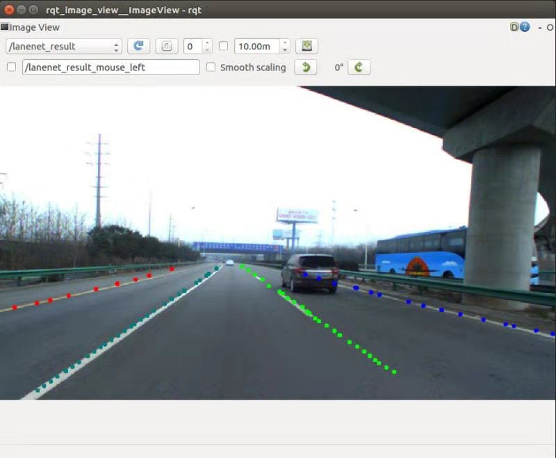
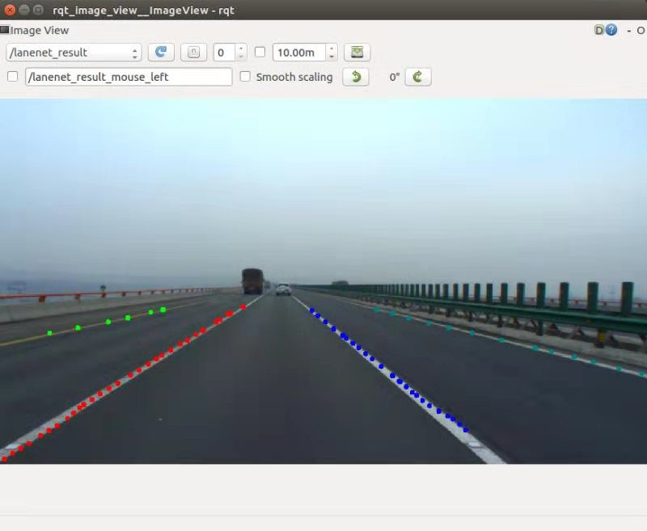

# lanenet-ros
> Thanks to the great work of [MaybeShewill-CV](https://github.com/MaybeShewill-CV) 
>
> [Lanenet-lane-detection](https://github.com/MaybeShewill-CV/lanenet-lane-detection)

- make lanenet work as a rosnode 

- take in `sensor_msgs/Image` Type ros message

- set topic name in `/scrpits/lanenet_node.py`

- model file is removed because of its size, place your tensorflow model in `/model`

- `vgg16.npy` pre-train model is removed because of its size, place it in `/data`.

- low processing rate remains a main problem of this repo , consider use `-r 0.2` to slow down the rosbag or modify the code to pass some frames

- pic from `rqt_image_view`

  

  

  